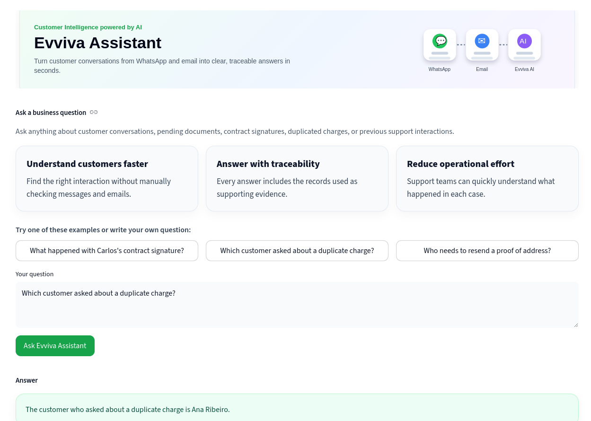

# Evviva

MVP RAG application for querying mocked WhatsApp and email conversations using FastAPI, Qdrant, FastEmbed, OpenAI, Docker, Streamlit, and uv.



Evviva is a customer intelligence assistant that uses **hybrid Retrieval-Augmented Generation** to answer business questions based on customer interactions.

The current MVP ingests mocked WhatsApp and email records, stores them in Qdrant, retrieves the most relevant records using hybrid search, and generates traceable answers with OpenAI.

The retrieval strategy combines:

- **Dense search** for semantic understanding;
- **Sparse search** for keyword and exact-term matching;
- **ColBERT reranking** to improve the final ranking of retrieved records.

This hybrid RAG approach improves search quality because it can find both meaning-based matches and exact references such as customer names, subjects, document IDs, protocols, or specific business terms.

## Stack

- Python 3.13
- FastAPI
- Streamlit
- PostgreSQL
- Qdrant
- FastEmbed
- OpenAI
- Chilkat
- Docker
- uv

## Project structure

```text
Gmail IMAP via Chilkat
        ↓
PostgreSQL staging
        ↓
email_messages
        ↓
email_chunks
        ↓
Embeddings
        ↓
Qdrant

Mock WhatsApp JSON
        ↓
Embeddings
        ↓
Qdrant

Qdrant
        ↓
FastAPI /search and /rag
        ↓
Streamlit frontend

```

## Environment variables

Create a `.env` file from `.env.example`:


## Run locally with Qdrant in Docker

Start Qdrant:

```bash
docker compose up -d qdrant
```

Start the FastAPI app locally:

```bash
uv run uvicorn api.main:app --reload
```

Useful URLs:

```text
Frontend: http://localhost:8501
API docs: http://localhost:8000/docs
Health:   http://localhost:8000
Qdrant:   http://localhost:6333/dashboard
```

## Ingestion commands

The ingestion pipeline prepares Qdrant, creates indexes, loads mock data, generates embeddings, and uploads documents to the vector database.

### Reset the collection

```bash
uv run python -m ingestion.reset_collection
```

Deletes and recreates the Qdrant collection. Use it when you want to rebuild the vector database from scratch. This removes all existing points.

### Create payload indexes

```bash
uv run python -m ingestion.create_indexes
```

Creates Qdrant indexes for metadata fields used in filters, such as source, document ID, conversation ID, sender, date, and file name.


### Check the collection

```bash
uv run python -m ingestion.check_collection
```

Shows the collection status, points count, segments count, and vector configuration. After the current mock ingestion, the expected result is around 32 points.

```bash
uv run python -m ingestion.save_chilkat_emails_to_postgres
```
Retrieves emails from Gmail using Chilkat and saves them into PostgreSQL.

```bash
uv run python -m ingestion.create_email_chunks
```
Creates text chunks from the email messages stored in PostgreSQL.

```bash
uv run python -m ingestion.ingest_data
```
Loads mocked WhatsApp JSON records and email chunks from PostgreSQL, generates dense, sparse, and ColBERT embeddings, and uploads the points to Qdrant.

### Recommended ingestion flow

```bash
uv run python -m ingestion.save_chilkat_emails_to_postgres
uv run python -m ingestion.create_email_chunks
uv run python -m ingestion.reset_collection
uv run python -m ingestion.create_collection
uv run python -m ingestion.create_indexes
uv run python -m ingestion.ingest_data
uv run python -m ingestion.check_collection
```

## Run with Docker Compose

To run the full stack with Docker Compose:

```bash
docker compose up --build
```

To run in the background:

```bash
docker compose up -d --build
```
To run Qdrant ingestion:
```bash
docker compose exec api uv run python -m ingestion.save_chilkat_emails_to_postgres
docker compose exec api uv run python -m ingestion.create_email_chunks
docker compose exec api uv run python -m ingestion.reset_collection
docker compose exec api uv run python -m ingestion.create_indexes
docker compose exec api uv run python -m ingestion.ingest_data
docker compose exec api uv run python -m ingestion.check_collection
```
to run Qdrant ingestion using a single file:
```bash
docker compose exec api uv run python -m ingestion.bootstrap
```

To stop:

```bash
docker compose down
```

## Main API endpoints

### `POST /llm/test`

Tests only the OpenAI integration. It does not use Qdrant or retrieval.

### `POST /search`

Runs semantic search against Qdrant. It retrieves relevant documents using dense search, sparse search, and ColBERT reranking. It returns documents, scores, and metadata, but does not generate a final AI answer.

### `POST /rag`

Runs the full RAG flow. It uses the same retrieval logic from `/search` internally, then sends the retrieved context and the user question to OpenAI.

```text
/search = finds the relevant documents
/rag    = finds the relevant documents and answers based on them
```
